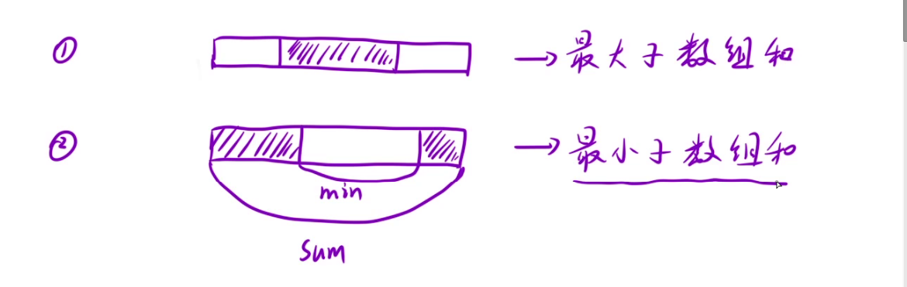

## DP

### 1. [三步问题](https://leetcode.cn/problems/three-steps-problem-lcci/) 2023.10.25

1. 状态表示
    经验（以某个位置为结尾/以某个位置为开始） + 题目要求
    dp[i] ： 到达i位置时（第i个台阶），一共有多少种方法

2. 状态转移方程
    以i位置的状态，**最近的一步**，来划分问题
    - 从 i - 1 / i - 2 / i - 3 三种位置到 i 位置

    dp[i] = dp[i-1] + dp[i-2] + dp[i-3]

3. 初始化
    dp[1] = 1
    dp[2] = 2
    dp[3] = 4

4. 填表顺序
   从左往右

5. 返回值
   dp[n]


```cpp{.line-numbers}
class Solution {
public:
    int waysToStep(int n) {
        // 1. 创建dp表
        // 2. 初始化
        // 3. 填表
        // 4. 返回值

        const int MOD = 1e9 + 7;

        // 处理边界条件
        if(n == 1 || n == 2) return n;
        if(n == 4) return 4;

        vector<int> dp(n+1);
        dp[1] = 1, dp[2] = 2, dp[3] = 4;
        for(int i = 4; i <= n; ++i)
            dp[i] = ((dp[i - 1] + dp[i - 2]) % MOD + dp[i - 3]) % MOD;
        return dp[n];
    }
};
```


### 2. [使用最小花费爬楼梯](https://leetcode.cn/problems/min-cost-climbing-stairs/) 2023.10.26


#### 解法1:

1. 状态表示
    经验 + 题目要求
    以i位置为结尾，+ 具体题目要求
    dp[i]表示：到达i位置时的最小花费

2. 状态转移方程
    用之前或者之后的状态推导出dp[i]的值，经验告诉我们根据最近的一步来划分问题
    到达i位置有两种情况：从i-1或者i-2位置支付对应的钱到达i位置
    - 到达 i - 1 ，支付cost[i-1]，走一步
    - 到达 i - 2， 支付cost[i-2]，走两步

    dp[i] = min{ dp[i-1] + cost[i-1], dp[i-2] + cost[i-2]}

3. 初始化
    保证填表的时候不越界，由几个易推导的初值滚动求解
    dp[0] = dp[1] = 1

4. 填表顺序
    保证求dp[i]的时候dp[i-1],dp[i-2]已经求出
    从左往右

5. 返回值
    dp[n]

```cpp{.line-numbers}
class Solution {
public:
    int minCostClimbingStairs(vector<int>& cost) {
        int n = cost.size();
        vector<int> dp(n+1);
        dp[0] = dp[1] = 0;
        for(int i = 2; i <= n; i++)
            dp[i] = min((dp[i-1] + cost[i-1]),(dp[i-2] + cost[i-2]));
        return dp[n];
    }
};
```

#### 解法2:

1. 状态表示
    经验 + 题目要求
    以i位置为起点，+ 具体题目要求
    dp[i]表示：从i位置出发到达楼顶此时的最小花费

2. 状态转移方程

    dp[n] = 0
    dp[n-1] = cost[n-1]
    dp[n-2] = cost[n-2]

    支付cost[i]后走一步或者走两步（看哪一种的花费少）

    dp[i] = min{dp[i+1] + cost[i], dp[i+2] + cost[i]} = min{dp[i+1], dp[i+2]} + cost[i]

3. 初始化
    保证填表的时候不越界，由几个易推导的初值滚动求解
    dp[n] = 0
    dp[n-1] = cost[n-1]
    dp[n-2] = cost[n-2]

4. 填表顺序
    保证求dp[i]的时候dp[i+1],dp[i+2]已经求出
    从右往左

5. 返回值
    min{dp[0], dp[1]}

```cpp{.line-numbers}
class Solution {
public:
    int minCostClimbingStairs(vector<int>& cost) {
        int n = cost.size();
        // dp[i]表示：从i位置出发到达楼顶此时的最小花费
        // 按照这种状态表示，dp表只需要开和cost同等大小
        vector<int> dp(n);
        dp[n-1] = cost[n-1];
        dp[n-2] = cost[n-2];
        for(int i = n - 3; i >= 0; --i)
        {
            dp[i] = min(dp[i+1], dp[i+2]) + cost[i];
        }
        return min(dp[0], dp[1]);
    }
};
```


### 3. [解码方法](https://leetcode.cn/problems/decode-ways/) 2023.10.30

1. 状态表示

    根据经验 + 题目要求

    经验：以i位置为结尾/开始 巴拉巴拉

    dp[i] : 以i位置为结尾时，解码的方法总数

2. 状态转移方程

    经验：根据最近的一步划分问题

    情况1：单独考虑i位置的字符s[i]来解码 成功（'1' <= s[i] <= '9', dp[i-1]） or 失败 (0)

    情况2：s[i-1]与s[i]两者结合去解码 成功( 10 <= s[i-1]*10 + s[i-1] <= 26>, 不能有前导零，所以左边区间端点为10而不是1，dp[i-2]) or 失败(0)

    dp[i] = dp[i-1] + dp[i-2] (两者情况对应成功加对应的，否则加零)


3. 初始化

    保证填表的时候不越界

    dp[0] = 1（成功）or 0（失败）

    dp[1] = 2（都成功） or 1（两种成功其一） or 0（均失败）

4. 填表顺序

    从左往右

5. 返回值

    dp[n-1], n = 字符串长度

```cpp{.line-numbers}
class Solution {
public:
    int numDecodings(string s) {
        // 创建dp表
        // 初始化
        // 填表
        // 返回值
        int n = s.size();
        if(n == 0)  return 0;

        vector<int> dp(s.size(), 0);
        if(s[0] >= '1' && s[0] <= '9')
            dp[0] = 1;
        else
            dp[0] = 0;
        // 处理边界情况 需要考虑n = 1的情况
        if(n == 1) return dp[n-1];

        int two_digit = (s[0] - '0') * 10 + (s[1] - '0');
        if(two_digit >= 10 && two_digit <=26) dp[1] += 1;
        if(s[0] != '0' && s[1] != '0')  dp[1] += 1;

        for(int i = 2; i < n; ++i)
        {
            two_digit = (s[i-1] - '0') * 10 + (s[i] - '0');
            if(s[i] <= '9' && s[i] >= '1' )     dp[i] += dp[i-1];
            if(two_digit >= 10 && two_digit <= 26)      dp[i] += dp[i-2];
        }
        // for debug
        // for(auto e : dp)
        //     cout << e << " ";
        return dp[n-1];
    }
};
```

#### 复杂初始化过程的优化

发现上一段代码在初始化的时候比较复杂，一开始这个初始化的判断条件搞错，debug了好久orz 🤡

而且初始化的逻辑和我们在循环中填表的逻辑类似，我们可以将这个初始化的过程优化到循环里

具体的做法是在dp表前面加一个虚拟节点，原来的dp表为dp[0,n-1], 现在的dp表变为dp[0,n]，将原来的表中下标为0的位置映射到下标1的位置，1映射到2以此类推，新表中的下标0为虚拟节点

但是需要注意⚠️两点：

1. 虚拟节点放的初始值，要保证后面的填表是正确的
    对于很多问题，虚拟节点放的初始值位往往为0，但是❗️对于该问题，这个值为1！！！

    为什么？🧐

    循环填表的逻辑依据的是状态转移方程，即dp[i] = dp[i-1] + dp[i-2] (两者情况对应成功加对应的，否则加零)，此处影响的值为dp[2]

    即 dp[2] = dp[0] + dp[1] (两者情况对应成功加对应的，否则加零)

    加dp[1]: 说明该情况下s[1]不为‘0’

    加dp[0]: 说明s[0]与s[1]组合能成功译码，这个属于一种译码方式，都能成功译码了，总不能dp[0] = 0 加0呀，这个情况下要加1，故dp[0] = 1 (简单理解：就是什么时候用到dp[0]？是在能成功译码的时候用到，用到dp[0]代表其是一种合法译码方式，所以dp[0] = 1)

2. 下标的映射关系
    dp[i] 对应 s[i-1]

改进后的代码

```cpp{.line-numbers}
class Solution {
public:
    int numDecodings(string s) {
        // 创建dp表
        // 初始化
        // 填表
        // 返回值
        int n = s.size();
        if(n == 0)  return 0;
        // 多开一个空间增加虚拟节点
        vector<int> dp(s.size() + 1, 0);
        dp[0] = 1;
        if(s[0] != '0') dp[1] = 1;
        // 处理边界情况 需要考虑n = 1的情况
        // 注意下标的映射关系
        if(n == 1) return dp[1];
        for(int i = 2; i <= n; ++i)
        {
            int two_digit = (s[i-2] - '0') * 10 + (s[i-1] - '0');
            if(s[i-1] <= '9' && s[i-1] >= '1' )     dp[i] += dp[i-1];
            if(two_digit >= 10 && two_digit <= 26)      dp[i] += dp[i-2];
        }
        // for debug
        // for(auto e : dp)
        //     cout << e << " ";
        return dp[n];
    }
};
```


### 4.[不同路径](https://leetcode.cn/problems/unique-paths/) 2023.10.31

1. 状态表示

    经验 + 题目要求

    经验：以某一个位置为结尾/开始

    这里我们以[i,j]为结尾，dp[i][j]表示走到[i,j]位置的时候，一共有多少种方式

2. 状态转移方程

    经验：根据最近的一步，划分问题

    走到ij位置，最近的一步要么从上面来，要么从左边来

    dp[i][j] 要么从d[i-1][j]来，要么从dp[i][j-1]来

    dp[i][j] = dp[i-1][j] + dp[i][j-1]

3. 初始化

    使得填表的时候不越界，增加虚拟节点，加上一列一行（左上边的半圈）

    注意⚠️

    - 虚拟节点中的值，保证后面填表的结果时正确的，在该问题中虚拟节点中的值为0即可（但是对于dp[1][1]中的上面一个或者左边一个两者其一设置为1即可）
    - 下标的映射关系

4. 填表顺序

    从上往下填每一行

    每一行从左往右

5. 返回值

    dp[m][n]

```cpp{.line-numbers}
class Solution {
public:
    int uniquePaths(int m, int n) {
        vector<vector<int>> dp(m+1, vector<int>(n+1));
        dp[0][1] = 1;
        for(int i = 1; i <= m; i++)
        {
            for(int j = 1; j <= n; j++)
            {
                dp[i][j] = dp[i-1][j] + dp[i][j-1];
            }
        }
        return dp[m][n];
    }
};
```

### 5. [不同路径II](https://leetcode.cn/problems/unique-paths-ii/) 2023.11.1

1. 状态表示

    dp[i][j] 表示走到i，j位置时所有的方式

2. 状态转移方程

    dp[i][j] 由dp[i-1][j]或者dp[i][j-1]走过来

    但是要考虑障碍物，严格按照我们前面的定义，显然有障碍物的格子是走不过来的，所以如果[i,j]上面有障碍物，则把dp[i][j]置为0

    dp[i][j] = dp[i-1][j] + dp[i][j-1] if obstacle[i-1][j-1] = 0 （此处考虑了虚拟节点的映射）

    dp[i][j] = dp[i-1][j] + dp[i][j-1] if obstacle[i-1][j-1] = 1


3. 初始化

    依旧增加虚拟节点，注意初始化有个虚拟节点要初始化为0

    同时对于有障碍物的节点，要初始化dp值为0

4. 填表顺序

    从左到右，从上到下

5. 返回值
    dp[m][n]

```cpp{.line-numbers}
class Solution {
public:
    int uniquePathsWithObstacles(vector<vector<int>>& obstacleGrid) {
        int row = obstacleGrid.size();
        int col = obstacleGrid[0].size();
        if(row == col && row == 1)
            return obstacleGrid[0][0] == 0;
        vector<vector<int>> dp(row + 1, vector<int>(col + 1));
        dp[0][1] = 1;
        for(int i = 1; i <= row; i++)
            for(int j = 1; j <= col; j++)
            {
                if(obstacleGrid[i-1][j-1] == 0)
                    dp[i][j] = dp[i-1][j] + dp[i][j-1];
                else
                    dp[i][j] = 0;
            }

        return dp[row][col];
    }
};
```

### 6.[礼物的最大价值](https://leetcode.cn/problems/li-wu-de-zui-da-jie-zhi-lcof/) 2023.11.2

1. 状态表示

    dp[i,j]到[i,j]位置时拿礼物的最大价值

2. 状态转移方程

    考虑到虚拟节点！注意和dp表的下标映射

    dp[i][j] = max(dp[i-1][j] + dp[i][j-1]) + frame[i-1][j-1]

3. 初始化

    显然只要全为0即可

4. 填表顺序

    左到右，上到下

5. 返回值

    dp[row][col]


```cpp{.line-numbers}
class Solution {
public:
    int jewelleryValue(vector<vector<int>>& frame) {
        int row = frame.size();
        int col = frame[0].size();
        if(row == col && row == 1)  return frame[0][0];

        vector<vector<int>> dp(row + 1, vector<int>(col + 1));
        for(int i = 1; i <= row; i++)
            for(int j = 1; j <= col; j++)
                dp[i][j] = max(dp[i-1][j], dp[i][j-1]) + frame[i-1][j-1];
        // for(auto& r : dp)
        // {
        //     for(auto& e : r)
        //         cout << e <<" ";
        //     cout << endl;
        // }
        return dp[row][col];
    }
};
//frame
// 1 3 1
// 1 5 1
// 4 2 1
// dp
// 1 4 5
// 2 9 10
// 6 11 12
```


### 7. [打家劫舍](https://leetcode.cn/problems/house-robber/description/?envType=study-plan-v2&envId=top-interview-150) 2023.11.2

最初自己手撕的版本

```cpp{.line-numbers}
class Solution {
public:
    // dp[i] 偷窃到 i 号房屋(且偷窃i房屋)的金额最大值 —— 以某个位置为结尾
    // 状态转移方程
    // dp[i] = max(dp[0] ...  dp[i-2]) + nums[i]

    // dp[0] = nums[0]
    // dp[1] = nums[1]

    // 返回值 max(dp[n-1], dp[n-2]); 偷倒数第一或者倒数第二个房屋的情况的最大值
    // 因为要求的是偷窃的最大值，显然最大偷窃方案必然含有倒数第一或者倒数第二

    int rob(vector<int>& nums) {
        int n = nums.size();
        if(n == 1)  return nums[0];
        vector<int> dp(n);
        dp[0] = nums[0];
        dp[1] = nums[1];
        for(int i = 2; i < n; i++)
        {
            int max = dp[0];
            for(int j = 1; j <= i-2; j++)
                if(max < dp[j])
                    max = dp[j];
            dp[i] = max + nums[i];
        }
        // for(auto& e : dp)
        //     cout << e << " ";
        return max(dp[n-1], dp[n-2]);
    }
};
```

参考了别人的题解得出更好的状态表示与状态转移方程

状态表示： dp[i] 表示偷盗i家屋子时最偷窃价值，**注意 i 号屋子不一定偷**

状态转移方程：dp[i] = max(dp[i-2] + nums[i], dp[i-1]) {根据i屋子偷与不偷来划分，如果偷，则i-1一定不偷，所以我们就根本不应该考虑dp[i-1]，而是只考虑dp[i-2], 所以是dp[i-2] + nums[i]，换一种角度考虑为什么不是dp[i-1] + nums[i], 因为dp[i-1]其实依赖i-1买或者不买，包含两种情况，当我们考虑偷i位置时，需要否决掉其中一个情况，而其dp[i]含两种情况，显然不符。 当我们不选择偷i时，i-1偷不偷？ 不知道！ 不确定！ 所以我们选择包含这两种情况的dp[i-1]}  —— 从中也看出，我们的状态转移方程紧紧依赖 严格遵照我们的状态表示


```cpp{.line-numbers}
class Solution {
public:
    int rob(vector<int>& nums) {
        int n = nums.size();
        if(n == 1)  return nums[0];
        vector<int> dp(n);
        dp[0] = nums[0];
        dp[1] = max(nums[1], nums[0]);
        for(int i = 2; i < n; i++)
            dp[i] = max(dp[i-2] + nums[i], dp[i-1]);
        return dp[n-1];
    }
};
```

### 8. [下降路径最小和](https://leetcode.cn/problems/minimum-falling-path-sum/) 2023.11.3

1. 状态表示

    dp[i][j] 表示到i,j位置时的最小下降路径

2. 状态转移方程

    注意结合了虚拟节点的映射关系

    dp[i][j] = min(dp[i-1][j-1], dp[i-1][j], dp[i-1][j+1]) + matrix[i-1][j-1]

3. 初始化

    为了初始化方便，以及状态转移时不考虑边界问题，我们增加头部一行，开始的左边和结尾的右边位置各增加一列（给原来的矩阵头上加个帽子😋）

    此时左右边界的两列初始化为最大值，让后续选择的时候选不上就行

    头部的一行设置为0，不去影响第一行dp的有效值

4. 填表顺序

    从左到右，从上到下

5. 返回值

    （掐头去尾考虑到虚拟节点）最后一行的最小值

    min(dp[len + 1][1 ... len + 1])

```cpp{.line-numbers}
class Solution {
public:
    int minFallingPathSum(vector<vector<int>>& matrix) {
        int len = matrix.size();
        if(1 == len)    return matrix[0][0];
        vector<vector<int>> dp(len + 1, vector<int>(len + 2));
        for(int i = 0; i < len + 1; i++)
        {
            dp[i][0] = 1e7;
            dp[i][len + 1] = 1e7;
        }
        for(int i = 1; i < len + 1; i++)
            for(int j = 1; j < len + 1; j++)
                dp[i][j] = min(min(dp[i-1][j-1],dp[i-1][j]), dp[i-1][j+1])
                            + matrix[i-1][j-1];
        int min = dp[len][1];
        for(int i = 2; i < len + 1; i++)
            if(min > dp[len][i])
                min = dp[len][i];
        return min;
    }
};
```


### 9. [最小路径和](https://leetcode.cn/problems/minimum-path-sum/) 2023.11.4

1. 状态表示

    dp[i][j]  表示走到 i, j 位置时的最短路径和

2. 状态转移方程

    显然根据最近的状态来，要么从左要么从上走到当前状态。显然只要两者间的最小值

    考虑到虚拟节点，要维护下标的映射关系

    dp[i][j] = min(dp[i-1][j], dp[i][j-1]) + grid[i-1][j-1]

3. 初始化

    新增一行一列的虚拟节点，且除了和dp[1][1]临接的上边和左边的格子初始化为0，其余初始化为最大值

4. 填表顺序

    左到右，上到下

5. 返回值

    dp[m][n]

```cpp{.line-numbers}
class Solution {
public:
    int minPathSum(vector<vector<int>>& grid) {
        int m = grid.size();
        int n = grid[0].size();

        vector<vector<int>> dp(m + 1, vector<int>(n + 1, 1e8));
        for(int i = 1; i <= m; i++)
            dp[i][0] = 1e8;
        dp[0][1] = dp[1][0];
        for(int i = 1; i <= m; i++)
            for(int j = 1; j <= n; j++)
                dp[i][j] = min(dp[i-1][j], dp[i][j-1]) + grid[i-1][j-1];
        return dp[m][n];
    }
};
```


### 10. [地下城游戏](https://leetcode.cn/problems/dungeon-game/) 2023.11.5

1. 状态表示

    - 以某个位置为结尾，巴拉巴拉

    dp[i][j]: 从起点出发到达i，j位置的时候，所需要的最低初始健康值 —— 无法推导状态转移方程 —— 按照这个定义，我们从左到右从上到下推导的时候，当前位置的状态不仅会受到上面状态的影响，也会受到后面状态的影响。而在我们推的时候无法得知后面状态。

    理解受到后面状态的影响：比如我们到中间的一个位置的状态，此时我们完全根据前面的状态推得，此时对后面的一个状态无感知（具体来说就是后面一步上是血包还是扣血不清楚），在这样的情况下我们根据前面的状态推的当前状态真的能走完全程吗？万一后面的一步扣超多血量，而我们根据前面的状态推导到当前的dp值不大，这种绝对是一个错误的解。

    - 以某个位置为起点，巴拉巴拉

    dp[i][j]: 从i, j 位置出发到达终点，所需的最低初始健康值

2. 状态转移方程

    dp[i][j] <--- 往下走或者往右走

    dp[i][j] = min(dp[i][j+1], dp[i+1][j]) - dungen[i][j]

    dp[i][j] = max(1, dp[i][j]) 如果dungen[i][j]过大，则表明这个位置有个超级大血包，以至于能使得该位置的初始dp值为负数都能走过，这个是显然不正确的，因为血量至少为1，故如果dp算到为负，要把dp值修正为1


3. 初始化

    保证填表不越界，我们要在最后一行以及最后一列添加一行一列

    最后一个格子下面和右边为1，其他设为无穷大

4. 填表顺序

    从右到左，从下往上

5. 返回值

    dp[0][0]

```cpp{.line-numbers}
class Solution {
public:
    int calculateMinimumHP(vector<vector<int>>& dungeon) {
        int m = dungeon.size();
        int n = dungeon[0].size();
        vector<vector<int>> dp(m + 1, vector<int>(n + 1, INT_MAX));
        dp[m-1][n] = dp[m][n-1] = 1;

        for(int i = m - 1; i >= 0; i--)
        {
            for(int j = n - 1; j >= 0; j--)
            {
                dp[i][j] = max(min(dp[i][j+1], dp[i+1][j]) - dungeon[i][j], 1);
            }
        }
        return dp[0][0];
    }
};
```

### 11. [按摩师](https://leetcode.cn/problems/the-masseuse-lcci/) 2023.11.6

多状态dp和打家劫舍问题一模一样！

[打家劫舍问题](#7-打家劫舍-2023112)

```cpp{.line-numbers}
class Solution {
public:
    // 其实是打家劫舍问题
    // dp[i] 选择到位置时总的最长预约时间（i位置可以选或者不选）
    int massage(vector<int>& nums) {
        int n = nums.size();
        if(n == 0) return 0;
        if(n == 1) return nums[0];
        vector<int> dp(n);
        dp[0] = nums[0];
        dp[1] = max(nums[0], nums[1]);
        for(int i = 2; i < n; i++)
            dp[i] = max(dp[i-1], dp[i-2] + nums[i]);
        return dp[n-1];
    }
};
```

### 12. [单词拆分](https://leetcode.cn/problems/word-break/) 2023.11.7

1. 状态表示

    dp[i] 表示i位置到字符串首位置，能否成功拆分

2. 状态转移方程

    先看最近的状态:
    如果dp[i-1] = true, s[0, i-2]在单词字典中，则dp[i] = true
    如果dp[i-2] = true, s[0, i-3]在单词字典中，则dp[i] = true
    如果dp[i-3] = true, s[0, i-4]在单词字典中，则dp[i] = true
    ...
    显然当前状态要由前面我们推导出来的所有状态推导出来

3. 初始化

    为了填表的时候不越界，我们仍然使用虚拟节点，i=0时会越界，我们在头部多开一个位置，我们只需要把虚拟节点dp[0]初始化即可。考虑i = 1的情况，此时dp[1]由dp[0]推出，此时的条件是dp[0] && s[0]在字符字典中，因为是虚拟节点，只要s[0]在字典中即可，所以dp[0] = true。

4. 返回值

    dp[s.size()];

```cpp{.line-numbers}
class Solution {
public:
    bool wordBreak(string s, vector<string>& wordDict) {
        // dp[i] i 位置是否可以成功拆分
        unordered_set<string> hashtable(wordDict.begin(), wordDict.end());
        vector<bool> dp(s.size() + 1, false);
        dp[0] = true;
        for(int i = 1; i <= s.size(); i++)
        {
            for(int j = 0; j < i; j++)
            {
                string word = s.substr(j, i - j);
                if(dp[j] && hashtable.find(word) != hashtable.end())
                    dp[i] = true;
            }
        }
        return dp[s.size()];
    }
};
```
### 13. [打家劫舍 II](https://leetcode.cn/problems/house-robber-ii/) 2023.11.9

#### 分析

题目与打家劫舍一的区别在于：首尾相连，偷了一第一个位置的房屋则末尾的房屋不能再偷

从第一个位置入手：

- 如果偷i = 0，则 i = 1， i = n - 1位置的房屋不能偷，此时 [2, n-2]区间内的问题就是线性的打家劫舍一
- 如果不偷i = 0， 则不需要考虑环形问题，此时问题转换为在[1, n-1]区间内进行线性的打家劫舍一的处理

最后我们的结果就是上面两种情况的最大值

虽然打家劫舍二套了一层环形的皮，但是通过分析会“出问题”的第一个位置的两种情况，可以把这样一个环形问题转化成两个线性的打家劫舍一来解决

```cpp{.line-numbers}
class Solution {
public:
    // 打家劫舍一
    // 在[begin, end]的闭区间上进行打家劫舍一
    int rob_1(const vector<int>& nums, int begin, int end)
    {
        int n = end - begin + 1;
        if(n == 1)  return nums[begin];
        vector<int> dp(n);
        dp[0] = nums[begin];
        dp[1] = max(nums[begin], nums[begin+1]);
        for(int i = 2; i < n; i++)
        {
            dp[i] =  max(dp[i-2] + nums[begin + i], dp[i-1]);
        }
        return dp[n-1];
    }

    int rob(vector<int>& nums) {
        int n = nums.size();
        if(n <= 3)
            return *max_element(nums.begin(), nums.end());
        return max(nums[0] + rob_1(nums, 2, n-2), rob_1(nums, 1, n-1));
    }
};
```

### 14. [删除并获得点数](https://leetcode.cn/problems/delete-and-earn/) 2023.11.9

通过将原始序列nums转化成序列值nums[i]为下标，下标对应数为num[i]总和的序列arr，将原问题转化为打家劫舍一问题

```cpp{.line-numbers}
class Solution {
public:
    // 打家劫舍一
    // 在[begin, end]的闭区间上进行打家劫舍一
    int rob_1(const vector<int>& nums, int begin, int end)
    {
        int n = end - begin + 1;
        if(n == 1)  return nums[begin];
        vector<int> dp(n);
        dp[0] = nums[begin];
        dp[1] = max(nums[begin], nums[begin+1]);
        for(int i = 2; i < n; i++)
        {
            dp[i] =  max(dp[i-2] + nums[begin + i], dp[i-1]);
        }
        return dp[n-1];
    }
    int deleteAndEarn(vector<int>& nums) {
        int n = *max_element(nums.begin(), nums.end());
        vector<int> arr(n + 1);
        for(const auto &e : nums)
            arr[e] += e;
        return rob_1(arr, 0, n);
    }
};
```

### 15. [粉刷房子](https://leetcode.cn/problems/JEj789/) 2023.11.11

1. 状态表示

开二维dp表，多状态dp，对于i位置的最小花费，可以细分为三种状态

dp[i][0] 表示：i位置涂上红色的最小花费
dp[i][1] 表示：i位置涂上蓝色的最小花费
dp[i][2] 表示：i位置涂上绿色的最小花费


2. 状态转移方程

    dp[i][0] = cost[i][0] + min(dp[i-1][1], dp[i-1][2])
    dp[i][1] = cost[i][1] + min(dp[i-1][0], dp[i-1][1])
    dp[i][2] = cost[i][2] + min(dp[i-1][0], dp[i-1][1])

3. 初始化

    dp[i][0] = cost[i][0]
    dp[i][1] = cost[i][1]
    dp[i][2] = cost[i][2]

    或者多开一行空间，用虚拟节点

4. 填表顺序

    从左到右从上往下

5. 返回值

    min(dp[i][0], dp[i][1], dp[i][2])

```cpp{.line-numbers}
class Solution {
public:
    int minCost(vector<vector<int>>& costs) {
        int n = costs.size();
        vector<vector<int>> dp(n + 1 , vector<int>(3, 0));
        for(int i = 1; i <= n; i++)
        {
            dp[i][0] = costs[i-1][0] + min(dp[i-1][1], dp[i-1][2]);
            dp[i][1] = costs[i-1][1] + min(dp[i-1][0], dp[i-1][2]);
            dp[i][2] = costs[i-1][2] + min(dp[i-1][0], dp[i-1][1]);
        }
        return *min_element(dp[n].begin(), dp[n].end());
    }
};
```

### 16. [买卖股票的最佳时机含冷冻期](https://leetcode.cn/problems/best-time-to-buy-and-sell-stock-with-cooldown/) 2023.11.11

1. 状态表示

    i天的最大利润有三种状态,定义：
    dp[i][0] : 第i天**结束**，处于买入状态的最大利润
    dp[i][0] : 第i天**结束**，处于可交易状态的最大利润。理解可交易：i天结束，手里没股票，后面**可以买**
    dp[i][0] : 第i天**结束**，处于冷冻期状态的最大利润

2. 状态转移方程

    此处为一个状态机，三个状态都要考虑能否自己到自己，自己到其他，最好画出状态转换图，注意得不重不漏
    dp[i][0] = max(dp[i-1][0], dp[i-1][1] - prices[i]) -> 第i天结束后处于买入状态有两种情况： i-1天结束处于买入状态，i天什么也不干 / i - 1天处于可交易状态，i天买入股票
    dp[i][1] = max(dp[i-1][1], dp[i-1][2]) -> 第i天出狱可交易状态有两种情况：i-1天结束处于可交易，i天啥也不干， i-1天结束处于冻结状态，第i天被冻结啥也不干
    dp[i][2] = dp[i][0] + prices[i] -> 第i天结束处于冷冻期有一种情况：i-1天结束处于买入状态，i天将股票卖出，i天结束进入冻结期（虽然i-1天结束后处于可交易状态）

3. 初始化

    dp[0][0] = -1 * prices[0];
    dp[0][1] = 0;
    dp[0][2] = 0;

4. 填表顺序

    左到右，上到下

5. 返回值

    max(dp[n-1][1], dp[n-1][2]) 因为最后一天结束如果处于买入状态一定不是最大利润，最后一天花出去的钱没有卖回来

```cpp{.line-numbers}
class Solution {
public:
    int maxProfit(vector<int>& prices) {
        int n = prices.size();
        vector<vector<int>> dp(n, vector<int>(3, 0));
        dp[0][0] = -1 * prices[0];
        dp[0][1] = 0;
        dp[0][2] = 0;
        for(int i = 1; i < n; i++)
        {
            dp[i][0] = max(dp[i-1][0], dp[i-1][1] - prices[i]);
            dp[i][1] = max(dp[i-1][1], dp[i-1][2]);
            dp[i][2] = dp[i-1][0] + prices[i];
        }
        return max(dp[n-1][1], dp[n-1][2]);
    }
};
```

### 17.[买卖股票的最佳时期含手续费](https://leetcode.cn/problems/best-time-to-buy-and-sell-stock-with-transaction-fee/) 2023.11.12

1. 状态表示

    dp[i] 第i天**结束**，所能获得的最大利润， dp[i]又可以分为两种状态：买入（手中没有股票） & 可交易（手中没有股票）

    选择 n * 2 的dp表，或者用两个数组表示dp表， f，g

    dp[i][0] 表示 i 天结束处于买入状态的最大利润

    dp[i][1] 表示 i 天结束处于可交易状态的最大利润

3. 状态转移方程

    dp[i][0] = max(dp[i-1][0], dp[i-1][1]-prices[i])
    dp[i][1] = max(dp[i-1][0] + prices[i] - fee, dp[i-1][1])

4. 初始化

    dp[0][0] = -price[i] 第一天直接买
    dp[0][1] = 0

5. 填表顺序

    左到右，上到下

6. 返回值

    dp[n-1][1] 最大利润一定是最后一天处于可交易状态


### 18.[买卖股票的最佳时机 III](https://leetcode.cn/problems/best-time-to-buy-and-sell-stock-iii/description/) 2023.11.13

1. 状态表示

    dp[i] : 第i天**结束之后**，所能获得的最大利润

    第i天又有两种状态，买入（手里有股票）f[i] 和卖出（手里没股票）g[i]
    将f[i] 扩展为f[i][j] j表示交易次数， g同理

    f[i][j]: 第i天结束，完成了j笔交易，此时处于买入状态（手里有股票）的最大利润
    g[i][j]: 第i天结束，完成了j笔交易，此时处于卖出状态（手里没有股票）的最大利润

2. 状态转移方程

    .png)

    f[i][j] = max(f[i-1][j], g[i-1][j] - prices[i])
    g[i][j] = max(g[i-1][j], f[i-1][j-1] + prices[i])

    从方程1:发现f和g只要初始化第一行
    从方程2:发现f除了需要初始化第一行还要初始化第一列 j = 0 时 j = -1 显然不存在-1笔交易，所以此时的max值只能是g[i-1][j]

    此时我们通过对状态转移方程进行一个微小的调整即可把这个初始化越界的问题解决

    step1: g[i][j] = g[i-1][j]

    step2: if(j - 1 >= 0) g[i][j] = max(g[i][j], f[i-1][j-1] + prices[i]) 即通过一个判断屏蔽掉交易次数为-1的情况

3. 初始化

    f[0][0] = -price[0], g[0][0] = 0

    f[0][1...n] = 负无穷大，因为交易次数有限，第一天显然不能交易到多笔，设置为一个负无穷大，就不会干扰到求max

    g[0][1...n] 同理设置为负无穷大，不干扰max

    注意⚠️细节问题： 如果设置为INT_MIN， 对于方程1会有一个减的操作，对于一个int最小值再减去一个值，会下溢，对于检查严格的编译器会直接报错，对于检查不严格的编译器，下溢后会变成一个很大的值

    所以此处我们选用的“负无穷大”设置为 负的0x3f3f3f3f，这是一个算法题常用的一个数
    一般可以用来表示很大和很小的数，保证加上或者减去一些不是那么大或者小的数字不会溢出

4. 填表顺序

    左到右，上到下

5. 返回值
    max(g[n-1][0], g[n-1][1], g[n-1][2])

```cpp{.line-numbers}
class Solution {
public:
    int maxProfit(vector<int>& prices) {
        int n = prices.size();
        const int MAX_DEAL_NUM = 2;
        const int NEG_INF = -0x3f3f3f3f;
        vector<vector<int>> f(n, vector<int>(MAX_DEAL_NUM + 1, NEG_INF));
        vector<vector<int>> g(f);
        f[0][0] = -prices[0];
        g[0][0] = 0;
        for(int i = 1; i < n; i++)
        {
            for(int j = 0; j < MAX_DEAL_NUM + 1; j++)
            {
                f[i][j] = max(f[i-1][j], g[i-1][j] - prices[i]);
                g[i][j] = g[i-1][j];
                if(j - 1 >= 0)
                    g[i][j] = max(g[i][j], f[i-1][j-1] + prices[i]);
            }
        }
        return *max_element(g[n-1].begin(), g[n-1].end());
    }
};
```

注： 这里给出了一个股票问题通解，可以通过修改MAX_DEAL_NUM来实现最多n笔的股票问题

### 19. [买卖股票的最佳时机 IV](https://leetcode.cn/problems/best-time-to-buy-and-sell-stock-iv/submissions/)

分析同上题一毛一样，并且上题给出了通解，将MAX_DEAL_NUM修改成k这道题就过了

```cpp{.line-numbers}
class Solution {
public:
    int maxProfit(int k, vector<int>& prices) {
        int n = prices.size();
        const int MAX_DEAL_NUM = k;
        const int NEG_INF = -0x3f3f3f3f;
        vector<vector<int>> f(n, vector<int>(MAX_DEAL_NUM + 1, NEG_INF));
        vector<vector<int>> g(f);
        f[0][0] = -prices[0];
        g[0][0] = 0;
        for(int i = 1; i < n; i++)
        {
            for(int j = 0; j < MAX_DEAL_NUM + 1; j++)
            {
                f[i][j] = max(f[i-1][j], g[i-1][j] - prices[i]);
                g[i][j] = g[i-1][j];
                if(j - 1 >= 0)
                    g[i][j] = max(g[i][j], f[i-1][j-1] + prices[i]);
            }
        }
        return *max_element(g[n-1].begin(), g[n-1].end());
    }
};
```

### 20. [最大子数组和](https://leetcode.cn/problems/maximum-subarray/) 2023.11.14

1. 状态表示

    dp[i] 表示: 以**i位置结尾**的**所有子数组**中的**最大和**

2. 状态转移方程

    dp[i] 所有子数组分为长度为1的子数组(nums[i]) 与 长度大于1的子数组（以i-1为结尾 + nums[i]）
    而dp[i-1]表示以i-1结尾的子数组的最大和

    那么状态转移方程呼之欲出 ： dp[i] = max(nums[i], nums[i] + dp[i-1])

3. 初始化

    dp[0] = nums[0]

4. 填表顺序

    左到右，线性dp

5. 返回值

    max(dp[0:n])

```cpp{.line-numbers}
class Solution {
public:
    int maxSubArray(vector<int>& nums) {
        int n = nums.size();
        vector<int> dp(n);
        dp[0] = nums[0];
        for(int i = 1; i < n; i++)
        {
            dp[i] = max(dp[i-1] + nums[i], nums[i]);
        }
        return *max_element(dp.begin(), dp.end());
    }
};
```


### 21. [环形子数组的最大和](https://leetcode.cn/problems/maximum-sum-circular-subarray/) 2023.11.16

分析：


由于连续子数组允许成环，很容易联想到我们前面做过的打家劫舍系列问题，将成环的问题分成两个线性问题

最大连续的子数组无非两种情况：

1. 在数组内部（不成环）， 这种情况就是前面一题的解决方案
2. 数组头尾的部分（成环）， 这种情况下，我们曲线救国，对于此时头尾的和最大，又由于我们的数组元素和为定值，那么对于数组刨去头尾的部分就是情况1，只不过此时和为最小值

按照不成环的情况dp做出连续子数组和的最小值minVal与mamVal，求max(maxVal, sum - minVal)即可

```cpp{.line-numbers}
class Solution {
public:
    // 求连续不成环子数组的最大和或者最小和，function
    int dpSubarrayLinar(vector<int>& nums, function<int(int, int)> f)
    {
        int n = nums.size();
        vector<int> dp(n);
        dp[0] = nums[0];
        for(int i = 1; i < n; i++)
        {
            dp[i] = f(nums[i], dp[i-1] + nums[i]);
        }
        int ret = dp[0];
        for(int i = 1; i < n; i++)
            ret = f(ret, dp[i]);
        return ret;
    }
    int maxSubarraySumCircular(vector<int>& nums) {
        int minVal = dpSubarrayLinar(nums, [](int a, int b){ return min(a, b);});
        int maxVal = dpSubarrayLinar(nums, [](int a, int b){ return max(a, b);});
        int sum = 0;
        for(auto e : nums)
            sum += e;
        return max( minVal < sum ? sum - minVal : -0x3f3f3f3f, maxVal);
    }
};
```

### 22.[]()
